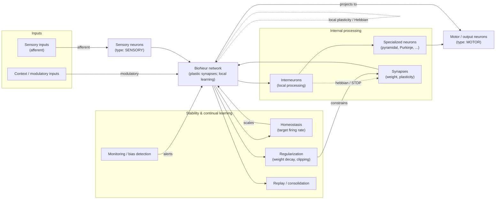

# BioNeur

## Algorithmic principles
energy minimization  
How does this "learn" and continue learning without becoming biaised, weird or smth?  


&nbsp;  

---

## Schema



&nbsp;  

---

## Mock Neuron Model
Focus: structure, local plasticity, stability mechanisms.

```python
from dataclasses import dataclass
from typing import List, Deque
from collections import deque
from enum import Enum
import math

@dataclass
class Synapse:
  weight: float = 0.0
  plasticity: float = 0.01    # local learning sensitivity

  def transmit(self, pre: float) -> float:
    return self.weight * pre

@dataclass
class Axon:
  length: float = 1.0
  conduction_delay: float = 0.0

@dataclass
class Dendrite:
  spines: int = 0
  local_potential: float = 0.0

class NeuronMorphology(Enum):
  UNIPOLAR = "unipolar"
  BIPOLAR = "bipolar"
  MULTIPOLAR = "multipolar"
  PYRAMIDAL = "pyramidal"
  PURKINJE = "purkinje"

class NeuronFunction(Enum):
  SENSORY = "sensory"
  MOTOR = "motor"
  INTERNEURON = "interneuron"

@dataclass
class NeuronType:
  name: str
  morphology: NeuronMorphology
  neurotransmitter: str
  function: NeuronFunction

class SignalKind(Enum):
  AGONIST = "agonist"
  ANTAGONIST = "antagonist"

class Neuron:
  def __init__(self, neuron_type: NeuronType, function: NeuronFunction,
                threshold: float = 0.5, target_rate: float = 0.1):
    self.synapses: List[Synapse] = []
    self.dendrites: List[Dendrite] = []
    self.axons: List[Axon] = []
    self.type = neuron_type
    self.function = function
    self.membrane = 0.0
    self.threshold = threshold
    self.firing_history: Deque[float] = deque(maxlen=200)
    self.target_rate = target_rate

  def forward(self, inputs: List[float]) -> float:
    total = sum(s.transmit(x) for s, x in zip(self.synapses, inputs))
    self.membrane = math.tanh(total)            # simple nonlinearity
    out = 1.0 if self.membrane >= self.threshold else 0.0
    self.firing_history.append(out)
    return out

  def hebbian_update(self, pre_acts: List[float], post_act: float, lr: float = 0.01):
    # Hebbian-like update + regularization + clipping
    for syn, pre in zip(self.synapses, pre_acts):
      dw = lr * syn.plasticity * pre * post_act
      syn.weight += dw
      syn.weight *= (1.0 - 1e-3)              # small weight decay
      syn.weight = max(-5.0, min(5.0, syn.weight))  # clip

    self._homeostatic_scaling()

  def _homeostatic_scaling(self):
    rate = sum(self.firing_history) / max(1, len(self.firing_history))
    if rate == 0:
      return
    scale = self.target_rate / (rate + 1e-6)
    # gently push weights toward maintaining target firing rate
    if 0.5 < scale < 2.0:
      for syn in self.synapses:
        syn.weight *= 1.0 + 0.01 * (scale - 1.0)

class SpecializedNeuron(Neuron):
  def __init__(self, specialization: str, **kwargs):
    super().__init__(**kwargs)
    self.specialization = specialization

@dataclass
class Signal:
  kind: SignalKind
  potency: float = 1.0
```

